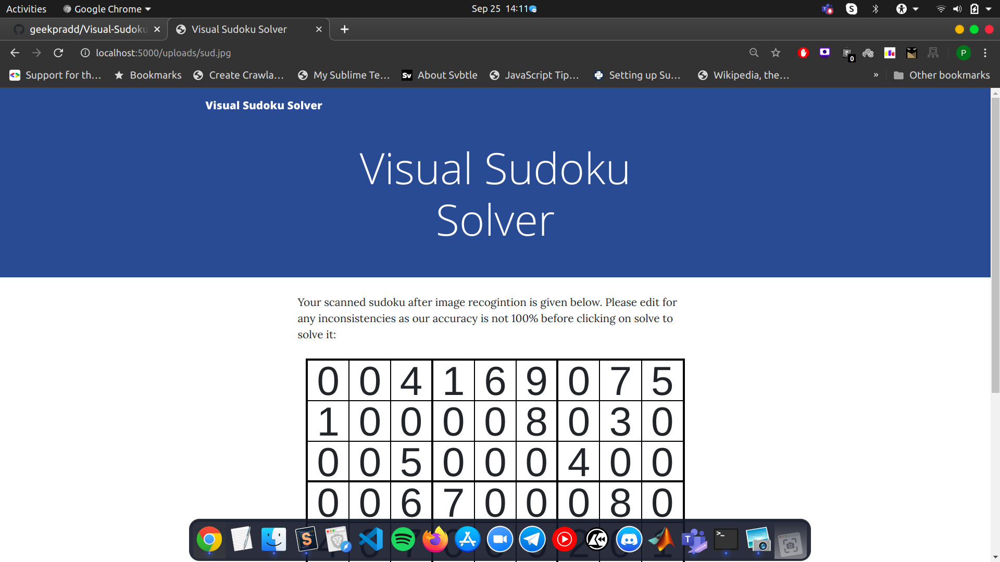

## Visual Sudoku Solver

This is a project that uses OpenCV in Python to recognise the sudoku grid and digits which will be classified using a neural network and then a C++ utility will solve the sudoku and output the final solved state.

The front end of the site is created in Flask and can be deployed on a webserver that has Keras/Tensorflow installed on it. It is possible to use the simpler neural network implementation based on NumPy by changing the model code but it gives poorer results and for usability the convulational version is recommended.

## Implementation Details

The basic idea is that using OpenCV we can find the contour with the largest area. This mostly will give us the sudoku grid but it may not be in the correct perspective. We can use perpsective transform after finding out the corner points using a line sweep method. This transform would give us the sudoku cropped and transformed to a square grid. Now we can simply iterate over the 81 blocks and after processing it to remove noise pass the pixel data to a neural network to recognise the digit. Then we can easily solve the sudoku using a heuristic c++ sudoku solver.

### Build Instructions

Simply clone the repository and run the following command in the site folder:
```
python app.py
```
Keras, TensorFlow along with SciPy need to be installed for the site to work along with Flask. If the standalone sudoku solver module is desired then simply import the sudoku model in the sudoku folder. Usage of this can be seen in the site folder as well.

The repository also contains a lot of the old standard numpy implementation along with testing code in the old folder. This can be safely neglected.

## Screenshots of the Portal

A portal has been created in Flask to provide a user friendly GUI front end for the sudoku solver:



